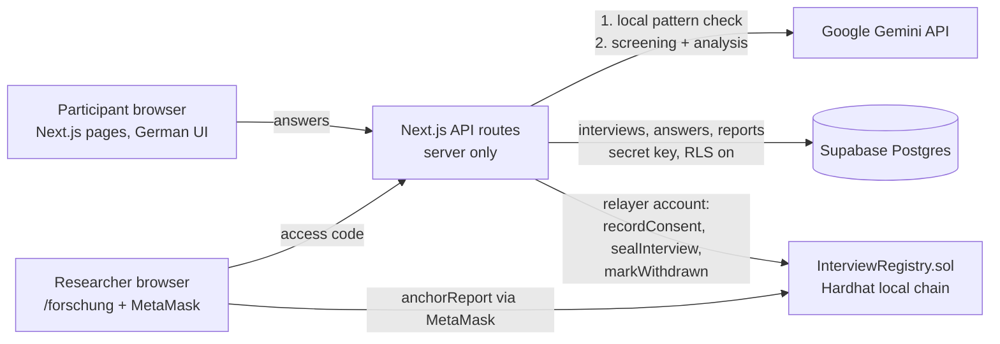

# Interviewstudie Pflege: an AI- and blockchain-backed interview platform

Final project for the elective **AI and Blockchain for Business** (ESCP Executive MBA, Prof. Edoardo Degli Innocenti).

The application runs the online interviews of our International Consultancy Project (ICP) on working conditions and documentation workload in German care homes. Care staff and management answer a legally reviewed questionnaire in German, in writing, on their phone or computer. **Gemini** protects anonymity while they write and helps the research team analyse the answers. **A smart contract** gives participants and examiners tamper-evident proof that consent was given before the first question and that no answer was changed afterwards.

Team: Zoe Lange-Gonzalez (project lead), Felix Neubert, Olivier Guyot, Thomas Tsigkopoulos.

---

## 1. Business use case

**Problem.** The ICP studies how much working time documentation and administration take up in German elder care. The interviews touch on sensitive ground: a care worker describing a shift can easily name a resident, a room number or a diagnosis, which exposes the interviewee under § 203 StGB and turns the answer into health data under Art. 9 GDPR. At the same time, the findings may later feed into a founding venture (Zoevis), so the team must be able to prove *when* consent covering both the academic and the commercial purpose was given, and that the evidence was not edited after the fact.

**How AI and blockchain work together.**

| Need | AI (Google Gemini) | Blockchain (Solidity contract) |
|---|---|---|
| Keep resident data out of the record | Screens every answer before it is saved; if it finds names, room numbers, dates or diagnoses, nothing is stored and the interviewer's verbatim "interrupt script" is shown | – |
| Respect the questionnaire's legal rules | Detects tools the respondent named *themselves* (unlocks the reactive Part D) and signs of distress (stops the family block) | – |
| Prove consent came first | – | Consent hash recorded on-chain before the first question is shown |
| Prove answers were not altered | – | Hash of the complete answer set sealed once at the end; anyone with the receipt code can recompute and compare |
| Right to withdraw (GDPR) | – | Withdrawal recorded on-chain; the off-chain answers and the salt are deleted, so the remaining hash becomes unlinkable |
| Turn 70+ open answers per question into evidence | Thematic analysis per question, perceived time estimates (A07.6), burden rankings (A03.2) | Hash of each AI report anchored by a researcher via MetaMask, so the report used in the thesis is provably the one generated |

The synergy: AI makes the data *safe and usable*, the blockchain makes the process *verifiable* – without putting any interview content on-chain.

---

## 2. Architecture



**Stack** (as prescribed): Next.js 15 (App Router, TypeScript) · Supabase · Google AI Studio API (Gemini, `@google/genai`) · Solidity + Hardhat 3 + viem · MetaMask · GitHub · Cursor.

### Components

| Path | Role |
|---|---|
| `app/page.tsx` | Landing page with study information (from the flyer) |
| `app/interview` + `components/InterviewFlow.tsx` | Role → consent → instructions → one question per screen → checkpoint → closing questions → receipt. Pause and stop are always visible |
| `app/beleg/[id]` | Receipt page: recomputes the answer hash, compares it with the chain, offers withdrawal |
| `app/forschung` | Research dashboard: counts, on-chain statistics, Gemini analysis per question, MetaMask anchoring |
| `app/api/interview/*` | start (consent on-chain) · answer (screening) · complete (seal) · withdraw |
| `app/api/verify/[id]` | Verification used by the receipt page |
| `app/api/research/*` | overview · analyze (Gemini) · anchor (confirms the MetaMask transaction on-chain) |
| `app/api/health` | Shows which parts of the stack are configured (no secrets) |
| `lib/questions.ts` | All 72 questions, generated from the questionnaire workbook by `scripts/extract_questions.py`; German wording verbatim |
| `lib/routing.ts` | Which questions each role gets, and in which order |
| `lib/screening.ts`, `lib/gemini.ts` | Two-layer anonymisation guard and AI analysis, with retry and fallback model |
| `scripts/seed-demo.mjs` | Runs four invented demo interviews through the real API |
| `lib/hash.ts`, `lib/chain.ts`, `lib/abi.ts` | Canonical hashing and contract access (viem) |
| `supabase/migrations/…sql` | Tables `interviews`, `answers`, `reports`, RLS on |
| `blockchain/contracts/InterviewRegistry.sol` | The contract (tests in `blockchain/test`, deployment in `blockchain/ignition/modules`) |

### Key design decisions

- **No personal data on-chain.** The contract stores only `keccak256` hashes and timestamps. Hashes are salted with a random 32-byte salt kept in Supabase; the salt is deleted on withdrawal.
- **Participants need no wallet.** A server-side *relayer* (Hardhat account #1) writes consent, seal and withdrawal. Researchers use MetaMask (account #0, the contract owner) to anchor reports.
- **Obvious identifiers never reach the AI.** Layer 1 is a local pattern check (room numbers, dates, "Frau/Herr + name"). Only answers that pass it are sent to Gemini (layer 2). Flagged answers are not stored; the participant rephrases or skips.
- **The AI cannot introduce a product.** Part D appears only when Gemini reports a tool *and* that tool name literally occurs in the participant's answer.
- **Resilient AI calls.** If Gemini reports overload (503) or a rate limit (429), the app retries and then switches to a fallback model (`GEMINI_FALLBACK_MODEL`, default `gemini-3.1-flash-lite`). If Gemini stays unavailable, answers are stored with `ai_checked=false` and flagged in the dashboard for manual review.
- **Database locked to the server.** Row Level Security is enabled with no policies; only the secret key (server code) can read or write.
- **Interview order follows the questionnaire's 25-minute rule.** Tier 1 questions first, in sheet order, then a checkpoint before tier 2 and tier 3. One deviation for self-administration: the closing block A11 is always asked last.
- **Role routing.** Pflegekraft: Part A, Part B, C05. Leitung: Part A (with the Heimleitung variant of A04.1), Part B, C01–C04. Angehörige: C06–C09 only, switched off by default (`NEXT_PUBLIC_ENABLE_FAMILY`). Part D is reactive for both professional roles.

### Data model (Supabase)

`interviews` (role, optional facility code from the invitation link, status, consent hash and transaction, salt, transcript hash, seal and withdrawal transactions) · `answers` (one row per question; `ai_checked=false` marks answers saved while Gemini was unavailable) · `reports` (AI analysis JSON, its hash, anchoring transaction).

### Smart contract

`InterviewRegistry` – owner plus allowed writers.
`recordConsent(id, consentHash)` → `sealInterview(id, transcriptHash)` (only after consent, only once) → optional `markWithdrawn(id)`; `anchorReport(reportHash, label)`; `getInterview(id)`. Custom errors: `NoConsent`, `AlreadySealed`, `AlreadyWithdrawn`, `NotWriter`, …

---

## 3. Vibecoding process

The application was built AI-first: we described *what* the platform must do in business and legal terms, and AI tools produced the architecture and code, which we then reviewed, tested and corrected. The full log, including prompts, is in [`docs/VIBECODING.md`](docs/VIBECODING.md). In short:

1. **Environment set up with Cursor's agent** (Next.js, GitHub, Supabase MCP in read-only mode, Gemini test route, Hardhat 3 local chain, MetaMask), documented step by step with every Windows problem and fix.
2. **Specification instead of code.** We gave the AI the assignment brief, our flyer and the questionnaire workbook (72 questions, legal assessment, interviewer instructions) and asked for an application that fulfils every requirement.
3. **AI-generated architecture and code** (Claude, Anthropic): question catalogue extracted programmatically from the workbook so the reviewed German wording stays verbatim; contract, tests, API routes, UI.
4. **Verification loop**, run by the AI and checked by us: contract tests (5/5 passing), production build with type checking, ESLint, an end-to-end script driving the app's own chain code against a local Hardhat node (consent → seal → tamper detection → withdrawal), and a scripted browser walkthrough with screenshots, which revealed a mobile layout bug that was then fixed.
5. **Integration and live tests**: merging into the repository, a build error caused by a different ESLint configuration (fixed), applying the Supabase migration, deploying the contract, a full test interview, a tamper test, and a Gemini overload during the first analysis, which led to automatic retries with a fallback model.

What we learned: the AI was fastest where the specification was precise (the workbook's routing and legal rules translated almost directly into code), and needed the most human judgement on data protection – for example, deciding that answers flagged for identifiers are never stored, rather than offering an override.

---

## 4. Run the application locally

### Prerequisites

Node.js 22 or newer, Git, a Supabase project, a Gemini API key, MetaMask in the browser. See the setup guide in this repository for account creation.

### 4.1 Install

```bash
git clone https://github.com/ttsigopoulos-cyber/repo.git
cd repo
npm install
cd blockchain && npm install && cd ..
```

### 4.2 Database

In the Supabase dashboard open **SQL Editor → New query**, paste the content of `supabase/migrations/20261001000000_interview_platform.sql` and click **Run**. Three tables appear under **Table Editor**.

### 4.3 Local blockchain (three terminals)

Terminal 1 – start the chain and keep it running:

```bash
cd blockchain
npx hardhat node
```

It lists test accounts with their private keys. Copy the private key of **Account #1** (address `0x7099…79C8`); it becomes the relayer key.

Terminal 2 – run the contract tests and deploy:

```bash
cd blockchain
npx hardhat test
npx hardhat ignition deploy ignition/modules/InterviewRegistry.ts --network localhost
```

Copy the address after `InterviewRegistryModule#InterviewRegistry`. After every restart of the chain, deploy again with `--reset` added.

### 4.4 Environment variables

Copy `.env.example` to `.env.local` and fill it in:

| Variable | Value |
|---|---|
| `NEXT_PUBLIC_SUPABASE_URL`, `SUPABASE_SECRET_KEY` | From Supabase, Project Settings → API Keys |
| `GEMINI_API_KEY` | From aistudio.google.com/apikey |
| `NEXT_PUBLIC_CONTRACT_ADDRESS` | Address from step 4.3 |
| `RELAYER_PRIVATE_KEY` | Account #1 key from `npx hardhat node` |
| `RESEARCH_ACCESS_CODE` | Any code of at least 8 characters, letters and digits only |
| `GEMINI_FALLBACK_MODEL` | Optional; default `gemini-3.1-flash-lite` |

### 4.5 Start the app

Terminal 3:

```bash
npm run dev
```

Open http://localhost:3000/api/health. All three parts should report as configured, and the chain as reachable. Then open http://localhost:3000.

### 4.6 MetaMask (research dashboard only)

Add the network *Hardhat Local* (RPC `http://127.0.0.1:8545`, chain ID `31337`, symbol ETH) and import the private key of **Account #0** – the contract owner. Use this account only on the local chain.

### 4.7 Demo script

1. `/interview` → choose *Pflegekraft* → consent → first question.
2. Answer with "Zuerst zu Zimmer 12 …" → the interrupt message appears and nothing is saved.
3. Rephrase and mention a software tool by name → the next question asks about that tool (Part D).
4. Skip to the checkpoint → *Zu den Abschlussfragen* → finish → copy the receipt code.
5. `/beleg/<code>` → "stimmen mit der Prüfsumme überein".
6. In Supabase, edit one answer → reload the receipt page → mismatch is detected.
7. `/forschung` → access code → choose A07.6 → *Auswertung erstellen* → *Mit MetaMask verankern*.

Only use invented demo answers for this (see section 6).

### 4.8 Demo data

With the app and the Hardhat node running, a second terminal in the main folder runs:

```bash
node scripts/seed-demo.mjs
```

It sends four invented interviews (three care workers, one director of nursing) through the real flow: consent on-chain, Gemini screening, sealing. It takes about five minutes and prints the receipt codes. The research dashboard then shows themes, a median documentation time (question A07.6) and a burden ranking (A03.2). Demo interviews carry the facility code `DEMO`; remove them in the Supabase SQL Editor with:

```sql
delete from public.interviews where facility_code = 'DEMO';
```

The on-chain records remain, but they are only hashes and can no longer be linked to any content.

---

## 5. Optional: public demo

The brief accepts a local environment. For a public demo, deploy the app on Vercel and the contract on a public testnet (for example via Remix with MetaMask, passing the relayer address as the constructor argument). Then set `NEXT_PUBLIC_CHAIN_ID`, `NEXT_PUBLIC_CONTRACT_ADDRESS`, `RPC_URL` and `NEXT_PUBLIC_EXPLORER_TX_URL` accordingly, and use a fresh relayer wallet funded with test ETH – never a Hardhat test key.

---

## 6. Limitations and data protection

- **Course prototype, not cleared for fieldwork.** The consent text is a draft and must be signed off by qualified German counsel, as the questionnaire workbook already requires.
- **Gemini free tier.** On unpaid quota, Google may use prompts to improve its products and human reviewers may read them; Google advises against submitting personal information. Use invented answers for the demo. Real interviews would need a paid tier under Google's data processing terms.
- **Research access** is protected by a shared access code, which is adequate for a prototype only.
- **False positives** of the anonymisation check cannot be overridden by design; the participant rephrases or skips.
- **Hashes of personal data can themselves be personal data.** The salt-deletion design reduces, but is not a legal assessment of, this risk.
- The questionnaire workbook itself (with its legal assessments) is **not** part of this repository.

---

## 7. Updating the questions

If the workbook changes:

```bash
pip install openpyxl
python scripts/extract_questions.py path/to/questionnaire.xlsx
```
